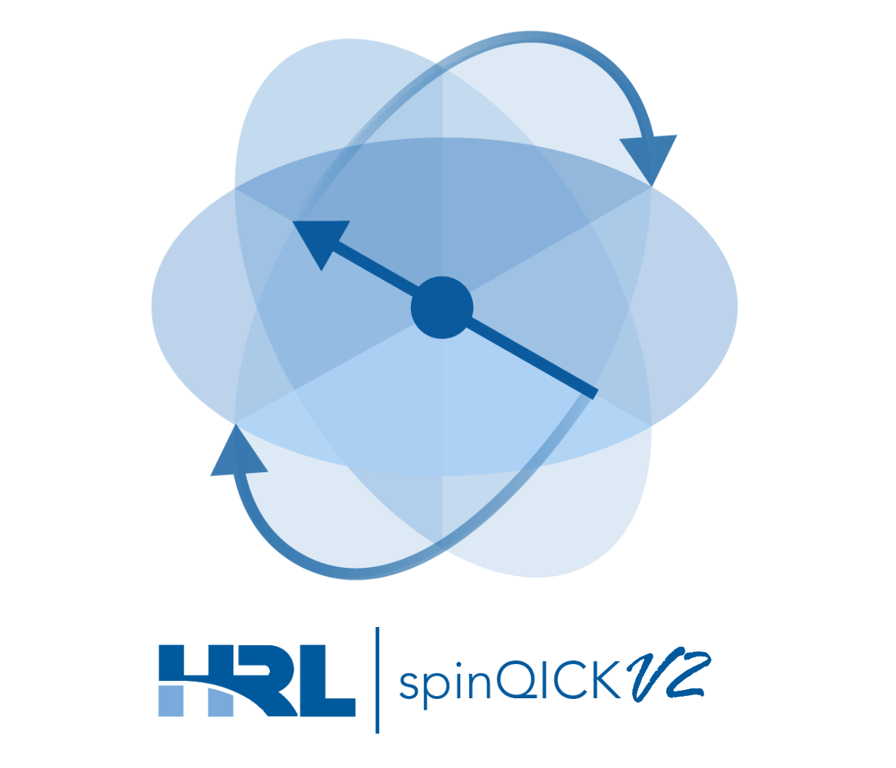

# spinQICK

 

## Read the docs
Full spinqick documentation is online [here](https://spinqick.readthedocs.io/en/latest/)

## Description
Welcome to spinQICK, an open-source extension to the [Quantum Instrumentation Control Kit](https://github.com/openquantumhardware/qick) (QICK) designed to control electrostatically confined solid-state spin-qubits! SpinQICK enables researchers to use low-cost off-the-shelf Xilinx Radio Frequency System-on-Chip (RFSoC) Field Programmable Gate Arrays (FPGAs) to rapidly develop novel application specific experimental hardware and software for controlling spin-qubits.

This package utilizes both the standard QICK API and modified low-level QICK assembly to implement standard measurement and control methods that are unique to electrostatically confined spin-qubit systems. These methods currently accomodate single-spin (Loss-DiVincenzo) qubits and include charge-stability and electrostatic tune-up, initialization and parity readout, single-spin and exchange-only coherent control and characterization (T1, T2*, T2-Echo, Ramsey, All-XY), exchange calibration, and two-qubit gates between single-spins. In addition to these facilities, this package also provides features for parameter-management, plotting, basic data management and demonstrations to help get started with spinQICK.

The repository contains code for spinQICK V2, which updates spinQICK for compatibility with the updated [tProcV2](https://github.com/meeg/qick_demos_sho/blob/main/tprocv2/qick_processor_TRM.pdf) core processor from QICK. This expands the number of DACs from 8 to 16, allowing for six single-qubits or two exchange-only qubits. In addition to this, the latest firmware allows for upto five digitization channels. spinQICK V2 makes use of a modified firmware, found [here](https://s3df.slac.stanford.edu/people/meeg/qick/tprocv2/2025-06-11_216_tprocv2r23_rfbv2_16fullspeed/), that enables 16 full-speed outputs with real-only generation for improved waveform memory. Near-term updates will include cross-talk compensation with this firmware as well.

## Hardware

### Non-QICKBox usage
- [ZCU216 RFSoC](https://www.xilinx.com/products/boards-and-kits/zcu216.html)
- [LMH5401](https://www.ti.com/tool/LMH5401EVM) DC Coupled Differential Amplifiers
- [THS3491](https://www.ti.com/product/THS3491) DC Coupled Single-ended Amplifiers (needed only for exchange gates)
- [PMOD level shifter](https://digilent.com/shop/pmod-lvlshft-logic-level-shifter/?srsltid=AfmBOoqZodUKJkK6xvxAk7vgOS6NISjlLeNHoWDSeB-TueM1wp54cUVR) to buffer the trigger pulses for improved stability
- Precision DC bias (QDevil QDAC, Basel LNHR, etc)
- Support hardware including DC supplies for amplifiers, control computer, etc.

### QICKBox usage
RealDigital provides a modular RFSoC frontend and enclosure, called [QICKBox](https://www.realdigital.org/hardware/qick) for use with QICK and by extension spinQICK, which makes integration of frontend hardware simpler. A recommended QICKBox setup for spinQICK includes:
- RF 216 Main board and Case (1x)
- Balun In (1x)
- DC Out (2x)

A complete kit can be customized and purchased [here](https://www.realdigital.org/hardware/qick)

### HMC-QuACK (under development)
The Harvey-Mudd College Quantum Analog Control Kit (QuACK) is an add-on that provides upto 32 channels of low-noise 20-bit [AD5791](https://www.analog.com/en/products/ad5791.html) DACS that can be directly controlled and triggered via QICK with no need for external triggers/markers. This low-cost alternative to commercial high-channel count low-noise DACs are based off of the available [CN0531](https://www.analog.com/en/resources/reference-designs/circuits-from-the-lab/cn0531.html) eval board. QuACK is in late development, and will be integrated into spinQICK in upcoming updates. More information can be found [here](https://github.com/hrl-labs-clinic-24-25). Check in for updates!

## Software
- Python 3.10, specific packages can be found in the _dev_environment.yml_ file
- [QICK](https://github.com/openquantumhardware/qick) version 0.2.360 (later versions will be checked for compatibility)
- Pynq 2.7 bootloader, QICK standard boot can be found [here](https://github.com/sarafs1926/ZCU216-PYNQ/issues/1)
- Pyro4 must also be installed on the ZCU216 board, see [QICK demo](https://github.com/openquantumhardware/qick/blob/main/pyro4/00_nameserver.ipynb) for information on running Pyro server on the RFSoC

## Package Structure
All code for the API can be found in `src/spinqick` with demo notebooks illustrating the use of the API and resources for getting started found in `demo_notebooks`. The spinQICK API is organized into five folders as follows.

### Core
Core provides low-level functionality for quickly developing experimental routines in spinQICK. This includes the construction of various pulse types (`awg_pulses`, `eo_pulses` and `ld_pulses`), utilities for the setup of readout routines (`readout_v2` and `psb_setup`), the machinery for the construction of experiments (`dot_experiment`), and shared utilities (`spinqick_utils`). A major addition to spinQICK V2 is the inclusion of a `spinqick_data` sub-module which provides classes for handling various output data in standardized ways, providing added flexibility and security to experimental outputs.

### Experiments
High-level experimental code, including the general `dot_experiment` class inherited by subsequent experiments. Experiments are organized into exchange only (`eo_single_qubit`) and ld single (`ld_single_qubit`) and two qubit (`ld_2_qubit`), electrostatic tune-up (`tune_electrostatic`), and calibration experiments (`system_calibrations`). The readout functionality for Pauli-spin blockade can be found in `psb_setup`, and routines for taking noise using QICK's DSO functionality can be found in `measure_noise`.

### Helper functionality
Inside the `helper_function` directory is functionality to help manage data files (`file_manager`), hardware maps (`hardware_manager`), and plotting (`plot_tools`), as well as routines for generating common dac pulse shapes (`dac_pulses`). SpinQICK V2 adds an `analysis` sub-module to provide fitting functionality.

### Models
The models directory contains PyDantic models for various experimental config types. Using PyDantic allows for efficient type checking of experimental parameters among many other features. To see how to use these models and experimental configs see `demo_notebooks\00_getting_started.ipynb`.

### QICK code V2
The `qick_code_v2` directory represents the collection of underlying QICK API code used by experiments based on the tProcV2 instruction set and the ASM_v2 assembler. This code is written in the native QICK API or in QICK assembly, and represents the custom functions required for spin-qubit experiments. The custom averagers of spinQICK V1 have been removed in V2 with the updated averager functionality of the new tProcessor.

### Settings
In addition to the above four directories, the `settings.py` file contains a user-defined pydantic object with directories for data and config files. Default directories are all located in `C:/Data/QICK/` path.

## Updates
SpinQICK is under active development. As such there may be changes that break existing code built on this package. SpinQICK follows [Semantic Versioning](https://semver.org/), with patches and minor versions being backwards compatible, and major version revisions representing changes that break existing API implementation.

### Near-term Updates
Current implementation of the spinQICK API is built on the QICK [tProc V2r23](https://github.com/meeg/qick_demos_sho/blob/main/tprocv2/qick_processor_TRM.pdf) instruction set. Near-term updates to spinQICK in future revisions will add cross-talk compensation via DSP (based on an experimental firmware developed for spinQICK by Fermilab and found [here](https://s3df.slac.stanford.edu/people/meeg/qick/tprocv2/2025-08-01_216_tprocv2r25_rfbv2_16fullspeed_11xtalk/)), QuACK API integration, and improved handling of pulse-distortion. In addition to this spinQICK hopes to add 2-qubit operations to it's library of existing experiments.

## Authors
Abigail Wessels[1](#HRL), Andrew E. Oriani[1](#HRL)

<a name="HRL">1</a>: HRL Laboratories, LLC, 3011 Malibu Canyon Road, Malibu, California 90265, USA

## Acknowledgements
Earlier revisions of this software was created by HRL under Army Research Office (ARO) Award Number: W911NF‐24‐1‐0020. ARO, as the Federal awarding agency, reserves a royalty‐ free, nonexclusive and irrevocable right to reproduce, publish, or otherwise use this software for Federal purposes, and to authorize others to do so in accordance with 2 CFR 200.315(b). We would like to thank Sho Uemura, Gustavo Cancelo, Sara Sussman and the QICK team on their continued support in developing this package. We would like to acknowledge the help of Joe Broz, Edwin Acuna, and Jason Petta for the creation of this package.
