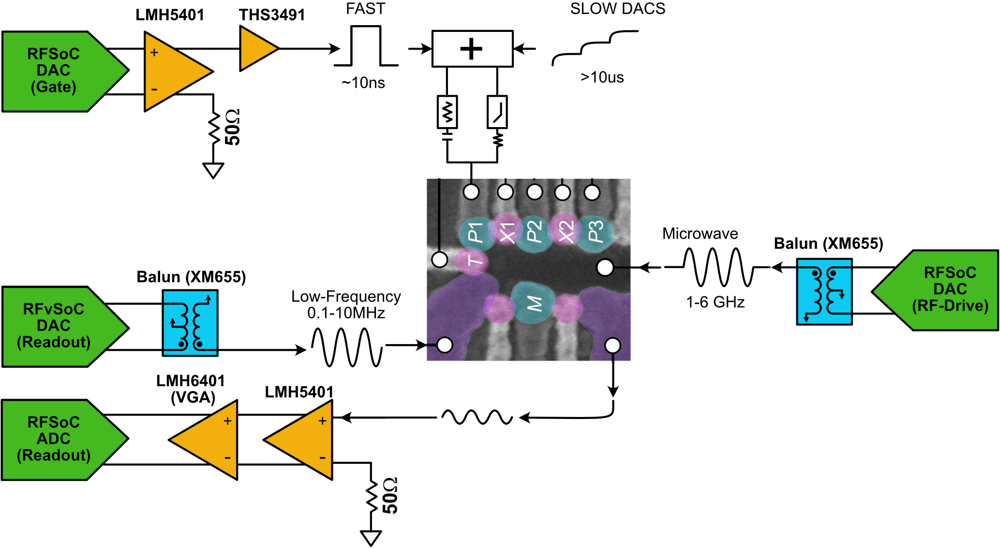

Getting started with spinqick
=============================

Instructions for installing and setting up spinQICK.  Start by setting up your qick board with the `qick quickstart guide <https://docs.qick.dev/latest/quick_start.html>`__.  Before you
clone qick and copy it to the board, read the instructions below pertaining to the firmware.

========
Hardware
========

SpinQICK is designed to operate the Xilinx ZCU216 evaluation board. This kit provides access to 16 high speed differential DAC outputs with balance-to-unbalanced (baluns) conversion of differential pairs to single ended AC coupled outputs. This works well for RF signals, but for baseband pulses we need a high-bandwidth way to DC couple to the RFSoC outputs and remove the common-mode voltage offset. We use a DC-coupled differential amplifier to do this. Similarly, for the readout of a DC current through a dot charge sensor (DCS), we can employ a single-to-differential amplification to pass our signal into the ADCs with approppriate dynamic range. We can do this with a homemade setup, shown in Fig 1, or with the QICKBox.

*Non-QICKBox usage*

    Figure 1: Standard measurement setup for spinQICK applications

- `ZCU216 RFSoC <https://www.xilinx.com/products/boards-and-kits/zcu216.html>`__
- `LMH5401 <https://www.ti.com/tool/LMH5401EVM>`__ DC Coupled Differential Amplifiers
- `LMH6401 <https://www.ti.com/tool/LMH6401EVM>`__ DC Coupled Differential Variable Gain Amplifer (for ADC)
- `THS3491 <https://www.ti.com/product/THS3491>`__ DC Coupled Single-ended Amplifiers (needed if the LMH5401 does not provide enough gain for your setup)
- `PMOD level shifter <https://digilent.com/shop/pmod-lvlshft-logic-level-shifter/?srsltid=AfmBOoqZodUKJkK6xvxAk7vgOS6NISjlLeNHoWDSeB-TueM1wp54cUVR>`__ to buffer the trigger pulses for improved stability
- Precision DC bias (QDevil QDAC, Basel LNHR, etc)
- Support hardware including DC supplies for amplifiers, control computer, etc.

*QICKBox usage*

RealDigital provides a modular RFSoC frontend and enclosure, called `QICKBox <https://www.realdigital.org/hardware/qick>`__ for use with QICK and by extension spinQICK, which makes integration of frontend hardware simpler. A recommended QICKBox setup for spinQICK includes:

- RF 216 Main board and Case (1x)
- DC In (1x) for ADC inputs
- DC Out (up to 4 if needed) for DC coupled DAC outputs
- Balun out (1x) for RF outputs, if needed

A complete kit can be customized and purchased `here <https://www.realdigital.org/hardware/qick>`__

============
Installation
============

You will need to clone both `spinqick <https://github.com/HRL-Laboratories/spinqick>`__ and `our fork of qick <https://github.com/HRL-Laboratories/qick>`__ from github.

Navigate to your local spinqick repository and run

::

    conda env create -f environment.yml
    conda activate spinqick
    pip install setup.py .

now navigate to the qick repository and run

::

    pip install setup.py .

Once you've set up your board, you will be ready to try the demo notebooks in spinqick/demo_notebooks.

========
Firmware
========

The recommended firmware bit and hwh files can be found `here <https://s3df.slac.stanford.edu/people/meeg/qick/tprocv2/2025-08-01_216_tprocv2r25_rfbv2_16fullspeed_11xtalk/>`__ .
This firmware will enable you to use the exchange-only experiments that were recently added to spinqick.  If you need more rf generators and not so many baseband pulsing channels, you can
use the `standard tprocv2 firmware <https://s3df.slac.stanford.edu/people/meeg/qick/tprocv2/2025-08-10_216_tprocv2r26_standard/>`__.

You will need to copy the firmware and the fork of qick onto the board, as described in the qick quickstart guide.

If using the crosstalk compensation firmware, you must initialize the XtalkSoc object in place of QickSoc.  When you start your pyro server, it will look something like this:

::

    from qick.pyro import start_server
    from qick.rfboard import XtalkSoc
    start_server(ns_host="localhost", ns_port=8888, proxy_name="myqick", soc_class=XtalkSoc, bitfile= <path to bitfile on your board>)
