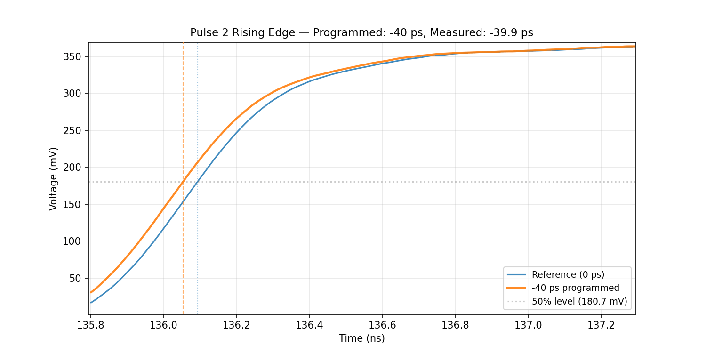

.. _filter-configuration:

Filter Configuration
====================

spinQICK includes a configurable filter system for shaping DAC waveforms
before they reach the hardware.  Filters are defined in a JSON config file
and automatically applied to envelopes during experiment execution.

This page covers the config file structure, available filter types, and how
to build filter paths for common use cases.

Config file structure
---------------------

The filter config is a JSON file with three sections:

.. code-block:: json

   {
       "filters": { ... },
       "paths":   { ... },
       "gate_scheme": { ... }
   }

**filters**
   A dictionary of named filter definitions.  Each entry specifies a
   ``"type"`` (matching a ``FilterTypes`` enum value) and any parameters
   for that filter. Refer to the filter_bank.py docstrings for details on
   each filter type, how to structure the config for it, and its parameters.

   Note: a kwarg path is available to help implement modified filter behavior
   of existing filters if users need to get more arguments from config to the
   underlying scipy signal functions.

**paths**
   A dictionary of named filter paths.  Each path is an ordered list of
   filter names from the ``filters`` section.  Filters are applied left
   to right.

**gate_scheme**
   Maps gate names or gate types to a path name.  When
   ``build_filter_map()`` runs, it resolves each hardware channel to a
   ``FilterPath`` via this mapping.  Set a gate to ``"none"`` to skip
   filtering.

Unit conventions
^^^^^^^^^^^^^^^^

All frequency parameters (e.g. ``cutoff``) are specified in **Hz** in the
config file.  ``FilterPath.apply()`` converts the DAC sampling frequency
from MHz (as returned by ``soccfg``) to Hz at the boundary, so all filter
internals use SI units.

Delay parameters (e.g. ``delay_ns``) are specified in **nanoseconds**.

Amplitude convention
^^^^^^^^^^^^^^^^^^^^

``FilterPath.apply()`` expects the input waveform in **DAC counts** (as
returned by ``dac_pulses.generate_baseband()``).  Before running the
filter chain the waveform is normalised by dividing by ``MAX_DAC_GAIN``
(32 766) so that every filter operates in the range [-1, 1] where
**1.0 = full DAC range**.  After filtering the result is scaled back to
DAC counts.

This means amplitude parameters such as ``CLIP(limit=1.0)`` and
``RENORMALIZE(target=1.0)`` are expressed as **fractions of the full DAC
range**, not raw integer counts.

Available filter types
----------------------

Window-kernel smoothing
^^^^^^^^^^^^^^^^^^^^^^^

These convolve the waveform with a small normalised window kernel to
smooth transitions.  Because the kernel sums to unity, constant regions
(including DC offsets and leading/trailing zeros) are preserved.

.. list-table::
   :header-rows: 1
   :widths: 20 40 40

   * - Type
     - Description
     - Parameters
   * - ``TUKEY``
     - Convolves with a Hann (raised-cosine) kernel.  ``alpha``
       controls kernel width as a fraction of waveform length.
     - ``alpha`` (0–1, default 0.5)
   * - ``GAUSSIAN``
     - Convolves with a Gaussian kernel.  ``alpha`` controls kernel
       width; ``sigma`` controls sharpness.
     - ``alpha`` (0–1, default 0.5), ``sigma`` (std-devs per kernel
       half, default 3.0)

Lowpass filters
^^^^^^^^^^^^^^^

These band-limit the waveform to reduce high-frequency content.

.. list-table::
   :header-rows: 1
   :widths: 20 40 40

   * - Type
     - Description
     - Parameters
   * - ``BESSEL``
     - Maximally flat group delay — near-zero overshoot on step edges.
     - ``order`` (default 4), ``cutoff`` in Hz, ``zero_phase``
       (default True)
   * - ``BUTTERWORTH``
     - Maximally flat magnitude response.
     - ``order`` (default 5), ``cutoff`` in Hz, ``zero_phase``
       (default True)
   * - ``SAVITZKY_GOLAY``
     - Local polynomial smoothing.  Preserves flat-top shape better
       than frequency-domain filters for short pulses.
     - ``window_length`` (positive odd int, default 11),
       ``polyorder`` (default 3)

General-purpose filters
^^^^^^^^^^^^^^^^^^^^^^^

.. list-table::
   :header-rows: 1
   :widths: 20 40 40

   * - Type
     - Description
     - Parameters
   * - ``FIR``
     - Apply pre-computed FIR taps via convolution.
     - ``taps`` (coefficient array)
   * - ``IIR``
     - Apply pre-computed IIR coefficients via causal ``lfilter``.
       Design coefficients externally (e.g. with ``scipy.signal``)
       for the DAC sample rate.
     - ``b`` (numerator), ``a`` (denominator)
   * - ``FRACTIONAL_DELAY``
     - Sub-sample time shift via windowed-sinc FIR interpolation.
     - ``delay_ns`` (ns), ``num_taps`` (default 21),
       ``window`` (default ``"hamming"``)

Amplitude adjustments
^^^^^^^^^^^^^^^^^^^^^

.. list-table::
   :header-rows: 1
   :widths: 20 40 40

   * - Type
     - Description
     - Parameters
   * - ``CLIP``
     - Hard-clip to ±limit (fraction of full DAC range).  Destructive —
       alters shape where it exceeds bounds.
     - ``limit`` (default 1.0)
   * - ``RENORMALIZE``
     - Rescale so peak equals target (fraction of full DAC range).
       Non-destructive — preserves shape.  Only acts if peak exceeds
       target.
     - ``target`` (default 1.0)

Nonlinear corrections
^^^^^^^^^^^^^^^^^^^^^

.. list-table::
   :header-rows: 1
   :widths: 20 40 40

   * - Type
     - Description
     - Parameters
   * - ``LOG_CORRECTION``
     - Logarithmic pre-compensation for exponential V→J coupling.
       ``A=0`` is identity; larger A = stronger compression.
       See Xue et al., arXiv:2107.00628.
     - ``A`` (dynamic-range parameter, default 100)

Building filter paths
---------------------

A filter path is an ordered chain of filters. Consider finishing the chain
with renormalization or clipping to ensure the output stays within bounds for filters
that may produce overshoot.
Occasionally, filters performed on full-gain waveforms can run into precision
issues when the gain is checked against max_gain (returning something like 32766
is greater than 32766), but this is resolved with the clip or renormalization filter.
Here are common patterns.

Band-limited plunger pulse
^^^^^^^^^^^^^^^^^^^^^^^^^^

Smooth the step edges with a Bessel filter:

.. code-block:: json

   {
       "filters": {
           "bessel_smooth": {"type": "BESSEL", "order": 4, "cutoff": 500e6, "zero_phase": true}
       },
       "paths": {
           "plunger_bandlimit": ["bessel_smooth"]
       }
       "gate_scheme": {
           "plunger": "plunger_bandlimit"
       }
   }

Exchange pulse with log correction
^^^^^^^^^^^^^^^^^^^^^^^^^^^^^^^^^^^

Shape the pulse envelope with a Tukey window, then apply log correction
so the exponential V→J mapping recovers the intended J(t) profile:

.. code-block:: json

   {
       "filters": {
           "tukey_exchange":  {"type": "TUKEY", "alpha": 0.5},
           "log_correction":  {"type": "LOG_CORRECTION", "A": 50}
       },
       "paths": {
           "exchange_tukey": ["tukey_exchange", "log_correction"]
       }
         "gate_scheme": {
              "exchange": "exchange_tukey"
         }
   }

Fractional-delay with pre-smoothing on one gate
^^^^^^^^^^^^^^^^^^^^^^^^^^^^^^^^^^^^^^^^^^^^^^^

Band-limit first (so the waveform edge is properly oversampled for the
interpolation kernel), then apply the sub-sample shift:

.. code-block:: json

   {
       "filters": {
           "bessel_smooth": {"type": "BESSEL", "order": 4, "cutoff": 500e6, "zero_phase": true},
           "fd_shift":      {"type": "FRACTIONAL_DELAY", "delay_ns": 0.05, "num_taps": 41},
           "clip":          {"type": "CLIP", "limit": 1.0}
       },
       "paths": {
           "fd_shifted": ["bessel_smooth", "fd_shift", "clip"]
       }
       "gate_scheme": {
           "P2": "fd_shifted"
       }
   }

The animation below shows a fractional-delay sweep measured on hardware,
with IIR smoothing applied before the interpolation kernel:

   Scope captures of a differential fractional-delay sweep
   using IIR pre-smoothing.

Gate scheme mapping
-------------------

The ``gate_scheme`` section connects hardware channels to filter paths.
Gate name takes priority over gate type, therefore ``build_filter_map()``
resolves each channel by checking (in order):

1. The gate **name** (e.g. ``"X2"``) in ``gate_scheme``.
2. The gate **type** (e.g. ``"plunger"``, ``"exchange"``) in ``gate_scheme``.
3. If neither matches, or the value is ``"none"``, no filter is applied.

.. code-block:: json

   {
       "gate_scheme": {
           "plunger":  "plunger_bandlimit",
           "exchange": "exchange_tukey",
           "aux":      "none",
           "X2":       "windowed"
       }
   }

In this example, all plunger-type gates get the ``plunger_bandlimit``
path, all exchange-type gates get ``exchange_tukey``, ``X2`` specifically
gets ``windowed`` (overriding its gate type), and aux gates are unfiltered.

Using FilterPath directly
-------------------------

You can also construct a ``FilterPath`` in code without a config file
for specific cases or experiments for instances where you won't be using
the spinQICK standard paths for constructing waveforms:

.. code-block:: python

   from spinqick.helper_functions.filter_bank import FilterPath

   fp = FilterPath(filter_conf=[
       {"type": "TUKEY", "alpha": 0.5},
       {"type": "LOG_CORRECTION", "A": 50},
       {"type": "CLIP", "limit": 1.0},
   ])

   # fs is in MHz (soccfg convention) — converted to Hz internally
   filtered = fp.apply(waveform, fs=dac_fs_MHz)

The ``pre`` and ``post`` arguments to ``apply()`` repeat the waveform
before/after filtering to mitigate edge effects from IIR or FIR filters:

.. code-block:: python

   filtered = fp.apply(waveform, fs=dac_fs_MHz, pre=1, post=1)

Adding a new filter type
-------------------------

1. Define a new ``Filter`` subclass in ``filter_bank.py`` (keep
   alphabetical order plz & thx).
2. Add the corresponding enum entry in ``FilterTypes`` in
   ``spinqick_enums.py``.
3. Use the ``"type"`` string in your filter config to reference it.

**Important**: The ``type`` field in the JSON config must match the enum name exactly
(e.g. ``"BUTTERWORTH"``, ``"FRACTIONAL_DELAY"``).
